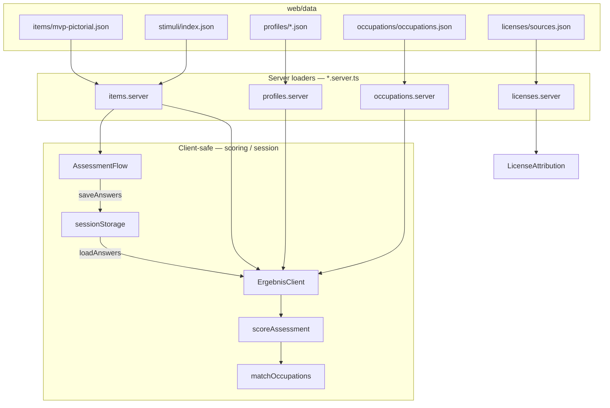

# Skillster

Privates, lokal laufendes Profiling-Tool für Jobcoaching-Orientierung.

- **Hinten:** große Datenbasis (VIST-Profile, Items, Lizenzen, später O\*NET/ESCO/PSE/OASIS)
- **Vorne:** einfacher Bild-Flow für Laien
- **Strategie:** Kernquellen frei/später verkaufbar; Extra-Quellen (NC) getrennt und austauschbar
- **Scoring:** parallele Persönlichkeit (VIST-Achsen) + Interessen (RIASEC), nested weights (kein Big-Five-E vs. RIASEC-E-Kollision), Zwischenprofile, Antworten in `sessionStorage`

## Start

```bash
cd web
npm install
npm run dev
```

Öffnen: [http://localhost:3000](http://localhost:3000)

## Tests & Build

```bash
cd web
npm test          # Vitest unit + integration
npm run build     # Next.js production build
```

Profile neu aus PDF extrahieren / Berufe aus O\*NET:

```bash
python3 scripts/extract_profiles.py
python3 scripts/import_occupations.py   # → web/data/occupations/occupations.json
cd web && npm run import:occupations    # gleichwertig
```

## Architektur



| Pfad | Inhalt |
|---|---|
| `skillster_daten-komprimiert.pdf` | Quell-PDF (VIST-Profile) |
| `scripts/extract_profiles.py` | PDF → JSON |
| `web/data/profiles/` | 16 Ergebnisprofile (VIST) |
| `web/data/items/` | Bildgestützte MVP-Items (nested weights) |
| `web/data/occupations/` | RIASEC-Berufsfeld-Seed |
| `web/data/licenses/sources.json` | Lizenzregister (core vs extra) |
| `web/data/stimuli/` | Stimulus-Registry + Platz für PSE/OASIS |
| `web/src/lib/` | Types, Scoring, Session, Occupations (siehe `lib/README.md`) |
| `web/src/lib/assessment/` | Catalog helpers + client-safe barrel |
| `web/src/app/` | UI: Start → Assessment → Ergebnis (HOW/WHAT) |

**Regel:** `*.server.ts` nutzt `fs` + `server-only` und darf nicht aus `"use client"` importiert werden. Pure Matching/Scoring läuft im Browser mit serverübergebenen Props.

## Flow

1. Assessment speichert Antworten in `sessionStorage` (keine URL-Payload)
2. Mid-session: Fortschritt bleibt; Sticky-Progress; Doppel-Tap-Schutz; „Neu starten“ mit Bestätigung
3. Ergebnisseite liest Session, scored clientseitig mit serverübergebenen Profilen/Seeds
4. Unvollständige Antworten → Hinweis + CTA „Weiter im Test“ (Coverage: „Basierend auf X von Y“)
5. **HOW:** VIST-Abschnitte (einklappbar) + Blend aus Nebenclustern
6. **WHAT:** RIASEC-Balken + Top-3 Berufsvorschläge in Alltagssprache
7. Footer: Lizenz-Attribution (core + owned)

## Manual smoke / Re-test

```bash
cd web
npm test          # Vitest unit + integration (session restore, coverage, catalog, all-A vs all-B)
npm run build
npm run dev
```

1. Startseite: Marke **Skillster**, CTA „Jetzt starten“ im unteren Thumb-Bereich
2. Assessment: Modul-Wechsel sichtbar, Fortschritt sticky, Wahl mit kurzem Pop; Reload mid-session setzt fort
3. „Neu starten“ → Bestätigungsdialog; Abbruch behält Antworten
4. Alle Items → `/ergebnis`: Hero-Muster, Coverage-Hinweis, Achsen, Top-3 Berufe, HOW einklappbar, „Kurzfassung kopieren“
5. `/ergebnis` mit Teilantworten → „Noch nicht fertig“; ohne Session → „Noch kein Ergebnis“

## Next milestones

1. O\*NET / ESCO Occupation-Import (core layer) + Attribution
2. CC0-Stimulus-Packs (Open Peeps/Humaaans) unter `stimuli/core/`
3. Normierung / Validierung der eigenen Items (aktuell: unvalidated)
4. Extra-Layer-Toggle (PSE/OASIS) strikt hinter Feature-Flag
5. Optional: Playwright smoke CI für Start → Assessment → Ergebnis

Alle eigenen Items sind als **unvalidiert** markiert.
