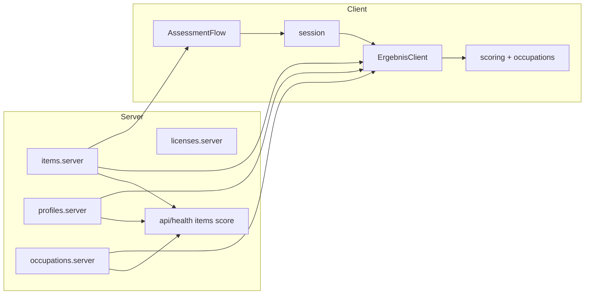

# `web/src/lib` — module boundaries

## Client-safe (may enter the browser bundle)

| Module | Role |
|---|---|
| `types.ts` | Shared domain types |
| `constants.ts` | Axis/RIASEC IDs, labels, thresholds |
| `scoring.ts` | Pure `scoreAssessment` (nested weights) |
| `bias.ts` | Response-pattern heuristics + Ergebnis guards (not psychometrics) |
| `plainLanguage.ts` | Layperson Ergebnis copy without letter-code jargon |
| `profilePdf.ts` | Client-side PDF export (jsPDF) |
| `session.ts` | `sessionStorage` + **cached** `getAnswersSnapshot` for `useSyncExternalStore` |
| `cn.ts` | `clsx` + `tailwind-merge` class helper |
| `occupations.ts` | Pure cosine matching (no fs) |
| `stimuli.ts` | Stimulus types + pure resolution |
| `assessment/` | Thin barrel + catalog helpers (sort/validate/resolve) |

## Server-only (fs / Node APIs — never import from `"use client"`)

| Module | Role |
|---|---|
| `items.server.ts` | Load MVP item catalog + resolve stimuli |
| `profiles.server.ts` | Load VIST profile JSON |
| `occupations.server.ts` | Load occupation seed JSON |
| `licenses.server.ts` | Load license attribution register |

## API routes (`app/api/*`)

Thin Next.js Route Handlers over the same pure libs:

| Route | Role |
|---|---|
| `GET /api/health` | Liveness |
| `GET /api/items` | Catalog meta (prompts/choices/visuals, no weight dump) |
| `POST /api/score` | `{ answers }` → `{ result: AssessmentResult }` |

**Scoring approach:** `/ergebnis` keeps **client-side** `scoreAssessment` (offline, no round-trip). `POST /api/score` is the server mirror for FE/BE separation and automated checks — same function, same inputs.

## Session hydrate note

`getAnswersSnapshot()` caches by raw `sessionStorage` string so `useSyncExternalStore` getSnapshot returns a stable reference (avoids infinite re-render loops).

Server pages (`app/**/page.tsx`) load data and pass serializable props into client components.

